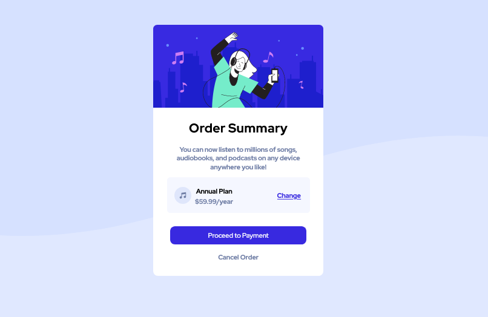

# Frontend Mentor - Order summary card solution

This is a solution to the [Order summary card challenge on Frontend Mentor](https://www.frontendmentor.io/challenges/order-summary-component-QlPmajDUj). Frontend Mentor challenges help you improve your coding skills by building realistic projects.

## Table of contents

- [Frontend Mentor - Order summary card solution](#frontend-mentor---order-summary-card-solution)
  - [Table of contents](#table-of-contents)
    - [Screenshot](#screenshot)
    - [Built with](#built-with)
    - [Links](#links)
    - [What I learned](#what-i-learned)

### Screenshot



### Built with

- Semantic HTML5 markup
- CSS Declarations
- Flexbox

### Links

- Solution URL: (https://www.frontendmentor.io/challenges/order-summary-component-QlPmajDUj)

### What I learned

```css
.proud-of-this-css {
  display: flex;
  justify-content: flex-end;
}

### Continued development

flexbox
grid
positioning

## Author

- Website - [Johnson Francis](https://www.my-site.com)
- Frontend Mentor - [@yourusername](https://www.frontendmentor.io/profile/bameejay)
- Twitter - [@bameejay](https://www.twitter.com/bameejay)
```
